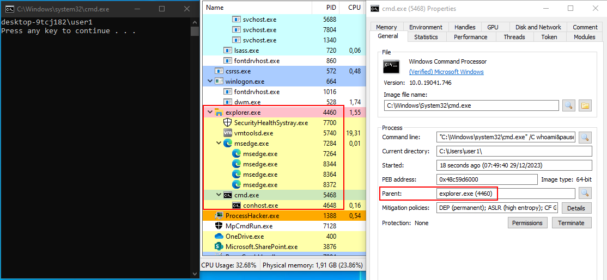
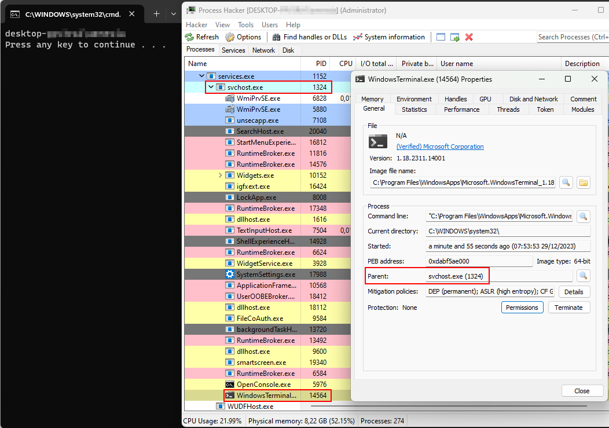

# Switching Parents - The User's Way

## About
This project demonstrates an alternative approach to start processes under a different parent process. Although this approach is somewhat conspicuous (the user might notice a prompt for a brief moment), it offers an (in my opinion) interesting alternative to more traditional techniques.

## How It Works
The method leverages the `SendInput` Windows function to simulate user inputs. Initially, it triggers the key combination `[CTRL]` + `[R]` to open the run dialog. Once this dialog is active, it's possible to input any command. In the current release, the script executes `cmd.exe` with arbitrary commands. For actual engagements, you might want to replace this with a more tailored payload. 😉

Here's how it behaves on different Windows versions:

- **Windows 10:** The new process runs under `explorer.exe`:

  

- **Windows 11:** The new process runs under `svchost.exe`:

  

## Note
Please be aware that this code's stability hasn't been extensively tested. Therefore, its use should be limited to proof-of-concept scenarios or controlled environments.

I'm 100% sure that there are different key-combinations this technique could use to start a new process.
I chose `[CTRL]` + `[R]` as it seems to be the least notable to the user, but I'm sure you'll think of the other ways if you'd need it.
